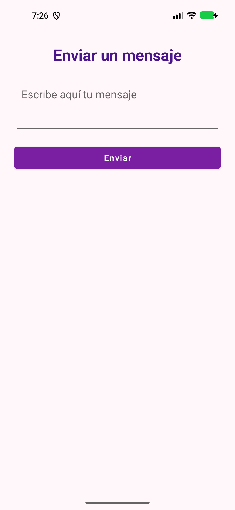
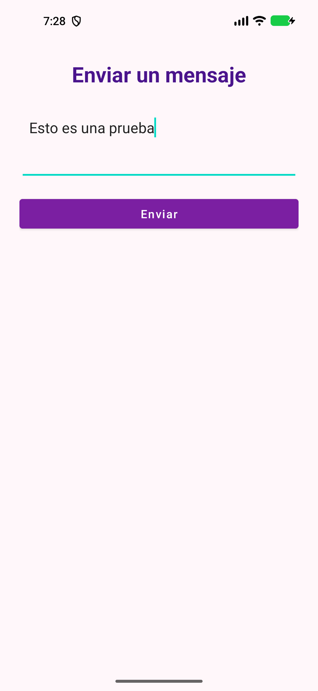
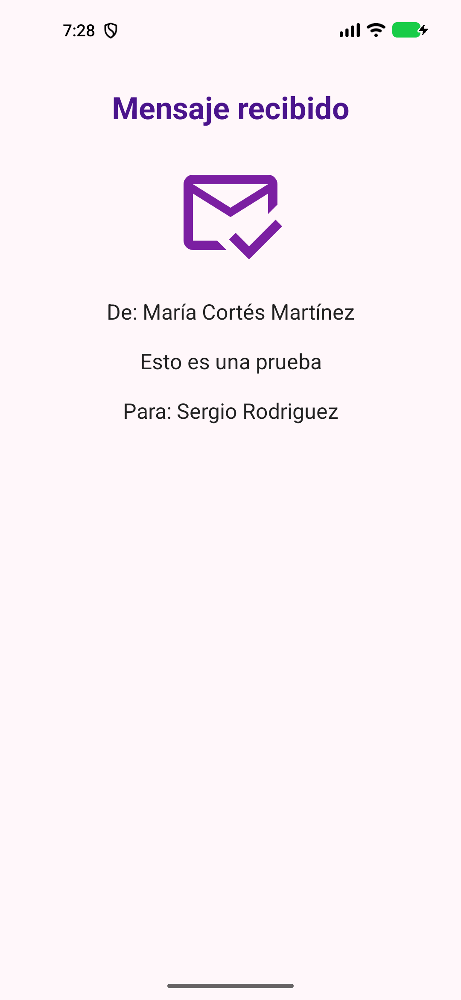

# SendMessage

## 1. Descripción del proyecto

SendMessage es una aplicación Android sencilla, desarrollada en Kotlin. Permite escribir un texto en una pantalla, crear un objeto que representa el mensaje y mostrarlo en una segunda pantalla.

El objetivo de la práctica es trabajar con Activities, interfaces declaradas en XML, el paso de datos mediante `Intent`, clases de datos serializables y el ciclo de vida de una Activity. El código actual no envía mensajes por Internet ni los guarda en una base de datos: el mensaje se pasa entre dos pantallas de la misma aplicación.

La aplicación admite desde Android API 24 (`minSdk`) y tiene `targetSdk` 36, según la configuración del módulo `app`.

## 2. Estructura del proyecto

```text
SendMessage/
├── app/
│   ├── build.gradle.kts                 # Configuración del módulo Android
│   └── src/
│       ├── main/
│       │   ├── AndroidManifest.xml       # Registro y punto de entrada de Activities
│       │   ├── java/com/example/sendmessage/
│       │   │   ├── SendMessageActivity.kt # Pantalla que crea y envía el mensaje
│       │   │   ├── ViewMessageActivity.kt # Pantalla que recibe y presenta el mensaje
│       │   │   └── model/
│       │   │       ├── Message.kt        # Modelo del mensaje
│       │   │       └── Person.kt         # Modelo de una persona
│       │   └── res/
│       │       ├── layout/
│       │       │   ├── activity_send_message.xml
│       │       │   └── activity_view_message.xml
│       │       ├── drawable/ic_message.xml
│       │       └── values/               # Textos, colores, dimensiones y tema
│       ├── test/                         # Prueba unitaria de ejemplo
│       └── androidTest/                  # Prueba instrumentada de ejemplo
└── gradle/libs.versions.toml             # Versiones de plugins y dependencias
```

Las pruebas incluidas son ejemplos básicos del proyecto: una comprueba una suma y otra verifica el identificador de paquete de la aplicación. No comprueban el recorrido completo de envío del mensaje.

## 3. Decisiones de diseño

- **Dos Activities:** `SendMessageActivity` se ocupa de la entrada del texto y `ViewMessageActivity` de su presentación. Ambas están declaradas en `AndroidManifest.xml`; la primera tiene el filtro `MAIN` y `LAUNCHER`, por lo que es la pantalla inicial.
- **Layouts XML separados:** cada Activity carga su propio archivo de `res/layout`. La interfaz está separada del código Kotlin y utiliza `LinearLayout`, `EditText`, `Button`, `TextView` e `ImageView`.
- **Modelos con `data class`:** `Message` agrupa `id`, `content`, `sender` y `receiver`; `Person` contiene `dni`, `name` y `surname`. Los parámetros del constructor dejan explícitos los datos de cada objeto.
- **Paso del objeto serializable:** `Message` y `Person` implementan `Serializable`. Así se entrega el mensaje completo mediante un extra del `Intent`, en vez de pasar solo el texto. Se ha elegido para practicar este concepto; Android también ofrece `Parcelable` y `Bundle` para transportar datos entre Activities.
- **Intent explícito y clave compartida:** el `Intent` indica directamente que debe abrirse `ViewMessageActivity`. La constante `EXTRA_MESSAGE` centraliza la clave usada para guardar y recuperar el objeto.
- **Tipo de botón coherente:** el XML declara un `<Button>` y el código lo obtiene como `Button`. Mantener el tipo de la vista y el tipo Kotlin alineados evita errores de conversión.
- **Recursos centralizados:** textos, colores, dimensiones y tema se mantienen en `res/values`. El icono vectorial de la pantalla receptora está en `res/drawable/ic_message.xml`.
- **Edge-to-edge e insets:** las Activities llaman a `enableEdgeToEdge()` y aplican los insets de las barras del sistema al layout raíz.
- **Etiquetas de Logcat por pantalla:** cada Activity define su propio `TAG`, `SendMessageActivity` o `ViewMessageActivity`, para poder distinguir sus registros.

## 4. Funcionamiento de la aplicación

1. Android inicia `SendMessageActivity`, que carga `activity_send_message.xml` con `setContentView`.
2. `findViewById` conecta el `EditText` y el `Button` del XML con variables Kotlin. Al botón se le asigna un `setOnClickListener`.
3. Cuando el usuario pulsa **Enviar**, el listener llama a `sendMessage` con el texto escrito.
4. `sendMessage` crea dos objetos `Person` de demostración y un objeto `Message`. En el código actual, los datos de esas personas son fijos y el identificador del mensaje es `1`.
5. La Activity crea un `Intent` dirigido a `ViewMessageActivity`, añade el `Message` usando la clave `EXTRA_MESSAGE` y llama a `startActivity`.
6. `ViewMessageActivity` recupera el extra. Desde Android 13 (API 33) usa la lectura tipada de `Serializable`; en versiones anteriores utiliza la lectura compatible con la API mínima del proyecto. Después forma el texto con `received_message_format` y lo asigna a `tvReceivedMessage`.

Si no se recibe un objeto `Message`, la segunda pantalla utiliza el texto de reserva definido en `received_placeholder`.

## 5. Proceso de depuración y uso de Logcat

1. Ejecuta la aplicación desde Android Studio en un emulador o dispositivo conectado.
2. En la herramienta **Logcat**, selecciona el dispositivo y el proceso de `com.example.sendmessage`.
3. Filtra por `SendMessageActivity` para ver los eventos de la pantalla de envío o por `ViewMessageActivity` para ver los de la pantalla receptora.
4. Escribe un mensaje y pulsa **Enviar**. Los métodos `onCreate`, `onStart`, `onResume`, `onPause`, `onStop` y `onDestroy` registran su ejecución con `Log.d`.

Al abrir la segunda pantalla se puede observar cómo la Activity de envío pierde el primer plano y cómo la receptora pasa por su creación, inicio y reanudación. Android ejecuta los callbacks según el ciclo de vida de cada Activity; los registros permiten seguir ese recorrido durante la práctica.

## 6. Documentación oficial de Android Developers

- [Introducción a las Activities](https://developer.android.com/guide/components/activities/intro-activities): qué es una Activity y cómo se declara en el manifiesto.
- [Ciclo de vida de una Activity](https://developer.android.com/guide/components/activities/activity-lifecycle.html): callbacks como `onCreate`, `onResume` y `onPause`.
- [Intents e intent filters](https://developer.android.com/guide/components/intents-filters): iniciar componentes y transportar datos.
- [Referencia de `Intent`](https://developer.android.com/reference/android/content/Intent): métodos `putExtra` y `getSerializableExtra`.
- [Parcelables y Bundles](https://developer.android.com/guide/components/activities/parcelables-and-bundles): otra opción documentada por Android para intercambiar datos entre Activities.
- [Layouts en Views](https://developer.android.com/develop/ui/views/layout/declaring-layout): interfaces XML, IDs, `setContentView` y `findViewById`.
- [Diseño edge-to-edge en Views](https://developer.android.com/develop/ui/views/layout/edge-to-edge): uso de edge-to-edge e insets.
- [Ver registros con Logcat](https://developer.android.com/studio/debug/logcat): inspeccionar mensajes de depuración de la aplicación.
- [Ver archivos del dispositivo con Device Explorer](https://developer.android.com/studio/debug/device-file-explorer): explorar archivos accesibles del dispositivo o emulador.

## 7. Evidencias de funcionamiento mediante capturas de pantalla

Las tres primeras capturas se tomaron en el emulador Pixel 5 con la versión actual de la aplicación. Las imágenes anteriores que ya estaban en `screenshots/` no se reutilizan: corresponden a una ejecución previa. Quedan pendientes las capturas de los paneles Logcat y Device Explorer.

### 7.1 Pantalla inicial

Captura de la aplicación al abrirse, antes de escribir un mensaje.



### 7.2 Mensaje escrito

Captura de la pantalla de envío con el texto «Esto es una prueba», antes de pulsar **Enviar**.



### 7.3 Mensaje recibido

Captura de la segunda pantalla después del envío, con remitente, contenido y destinatario.



### 7.4 Logcat

Captura Logcat durante la ejecución y procura que se vean las etiquetas actuales `SendMessageActivity` y `ViewMessageActivity` y sus eventos del ciclo de vida.

**Pendiente:** guarda la captura como `screenshots/03-logcat-actual.png` y coloca aquí:

```markdown

```

### 7.5 Device Explorer

Captura Device Explorer con la ruta completa `/data/data/com.example.sendmessage` visible.

**Pendiente:** guarda la captura como `screenshots/04-device-explorer-ruta.png` y coloca aquí:

```markdown

```

## Generación de la documentación de API

Desde la raíz del proyecto, ejecuta `./gradlew dokkaHtml` para generar la versión HTML en `documentation/index.html`. Para generar la versión Javadoc, ejecuta `./gradlew dokkaJavadoc`; el resultado queda en `documentation-javadoc/index.html`. El comando `./gradlew dokka Javadoc` genera ambos formatos.

El workflow `.github/workflows/desplegar-dokka.yml` genera el HTML y lo publica en GitHub Pages cuando se hace push a `main`. También puede ejecutarse desde **Actions → Desplegar Dokka en GitHub Pages → Run workflow**.

Para habilitar el despliegue, selecciona **GitHub Actions** en **Settings → Pages → Build and deployment → Source** del repositorio. Las ejecuciones se consultan en [Actions de SendMessageKotlin](https://github.com/sergioantsan/SendMessageKotlin/actions) y la documentación publicada queda en [GitHub Pages](https://sergioantsan.github.io/SendMessageKotlin/).
